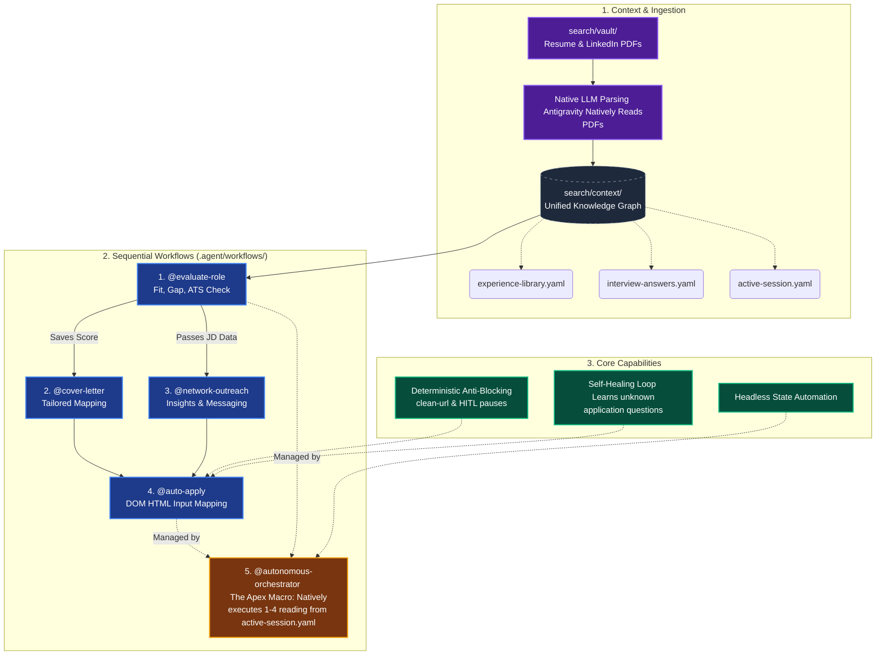

# Autonomous Career Operations Engine Architecture

This artifact contains a Mermaid diagram visualizing the core engine features, ingestion paths, and the sequential workflows of the Autonomous Career Operations Engine. For the high-fidelity landscape version, please open the newly generated `career_engine_infographic.html` in your browser.

